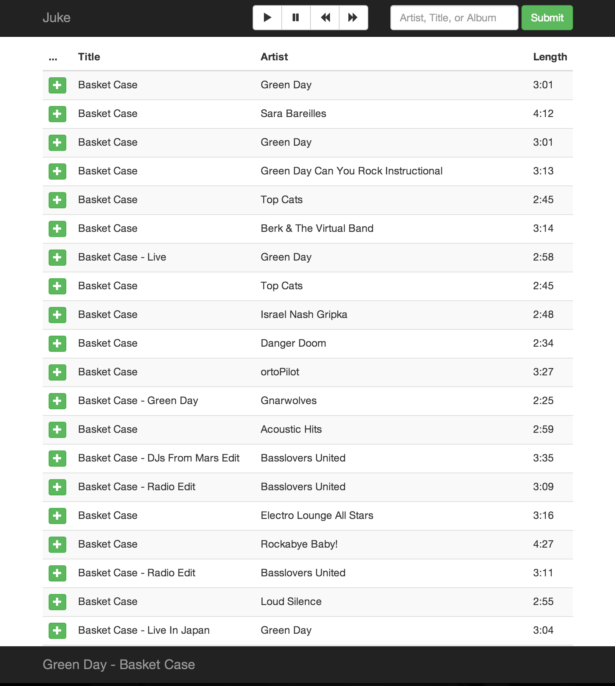

# Juke

Juke launches a lightweight Node server on the host machine and broadcasts a GUI endpoint/RESTful API to anyone on the same network. People on the network can add songs to a shared playlist from any device.

The server ingests the song requests and connects to a Spotify account to play them in order. The owner can control playback from the host machine or use an admin password to unlock the same controls on their phone.

Prerequisites
-------------

1. A computer with a web server installed. I used a Windows machine with xampp because it's a fairly painless set-up.
2. A Spotify account with developer mode enabled.
3. A hacky attitude.

Installation
------------

1. Copy the files in 'www' to a subdirectory of your web server root (/var/www/juke, C:\xampp\htdocs\juke, etc).
2. Copy the files in 'Spotify' to your "~/Spotify" directory (Linux, OS X) or "Documents/Spotify" (Windows). Create said directory, if it doesn't exist.
3. Create a SQL database and import "init/juke.sql". This should create three tables in your new DB.
4. Copy the config files "config.const.php" and "config.const.js" to wherever you want them to live.
5. Point "www/juke/index.html" and "Spotify/juke/index.html" to "config.const.js".
6. Point "www/juke/ajax_anon.php" to "config.const.php".
7. Edit "config.const.php" with DB host, DB name, and the proper credentials from your newly-created database (Step 3).
8. Edit "config.const.js" and insert your IP address so that the AJAX calls find the right file.

Set-Up
------
1. Restart Spotify
2. In the search bar, type "spotify:app:juke". Spotify should load the juke app.
3. Open a web browser and navigate to the dir that you copied the www files: "http://localhost/juke" or similar.

Notes
-----
* [You may (will probably) need to edit your httpd.conf file to allow other clients in your network access to your machine. Comment out the line that says "Deny from all" and insert a line that says "Allow from all".
